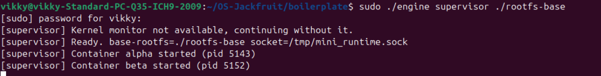
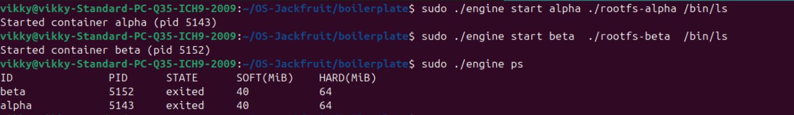
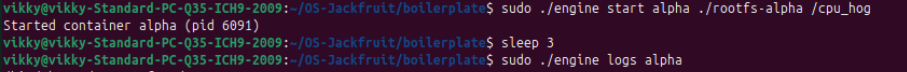
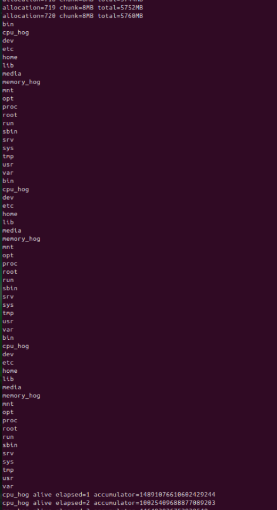
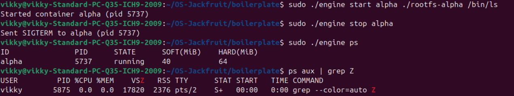
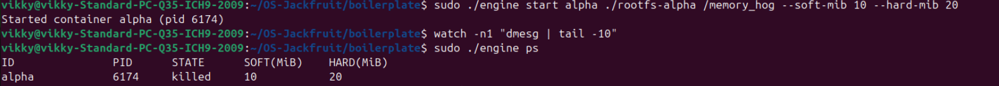
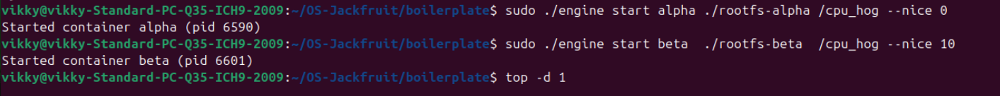
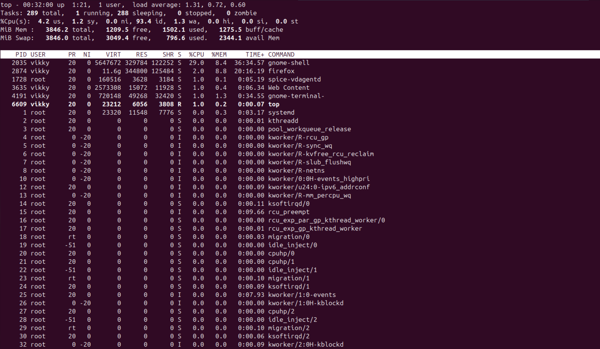
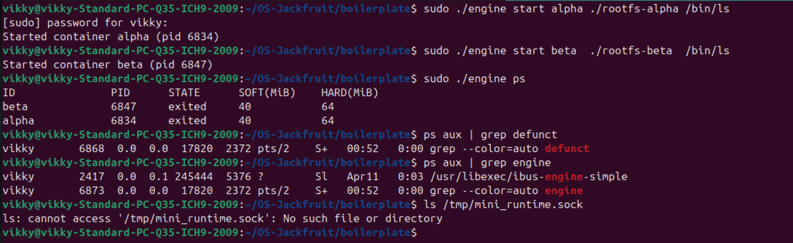

# Multi-Container Runtime

A lightweight Linux container runtime in C with a long-running supervisor, kernel-space memory monitor, bounded-buffer logging pipeline, and scheduling experiments.

---

## 1. Team Information

| Name | SRN |
|------|-----|
| Vikrant Acharyya | PES2UG24CS587 |
| Shashidharan VS  | PES2UG24CS568 |

---

## 2. Build, Load, and Run Instructions

### Prerequisites

Ubuntu 22.04 or 24.04 in a VM with Secure Boot OFF. No WSL.

```bash
sudo apt update
sudo apt install -y build-essential linux-headers-$(uname -r)
```

### Build

```bash
cd boilerplate
make
```

This builds:
- `engine` — user-space runtime and supervisor
- `monitor.ko` — kernel memory monitor module
- `memory_hog`, `cpu_hog`, `io_pulse` — test workloads

### Load Kernel Module

```bash
sudo insmod monitor.ko
ls /dev/container_monitor   # verify device was created
```

### Prepare Root Filesystem

```bash
cd boilerplate
mkdir rootfs-base
wget https://dl-cdn.alpinelinux.org/alpine/v3.20/releases/x86_64/alpine-minirootfs-3.20.3-x86_64.tar.gz
tar -xzf alpine-minirootfs-3.20.3-x86_64.tar.gz -C rootfs-base

# One writable copy per container
cp -a rootfs-base rootfs-alpha
cp -a rootfs-base rootfs-beta
```

### Run the Supervisor

```bash
# Terminal 1 — stays alive
sudo ./engine supervisor ./rootfs-base
```

### Launch and Manage Containers

```bash
# Terminal 2 — all commands from boilerplate/

# Copy workloads into rootfs before launching
cp memory_hog rootfs-alpha/
cp cpu_hog rootfs-alpha/
cp cpu_hog rootfs-beta/

# Start containers
sudo ./engine start alpha ./rootfs-alpha /bin/ls --soft-mib 48 --hard-mib 80
sudo ./engine start beta  ./rootfs-beta  /bin/ls --soft-mib 64 --hard-mib 96

# List tracked containers
sudo ./engine ps

# View container logs
sudo ./engine logs alpha

# Stop a container
sudo ./engine stop alpha

# Run a container and wait for it to finish
sudo ./engine run alpha ./rootfs-alpha /cpu_hog --soft-mib 48 --hard-mib 80
```

### Inspect Kernel Events

```bash
dmesg | tail -20
```

### Unload Module and Clean Up

```bash
sudo rmmod monitor
rm -f /tmp/mini_runtime.sock
```

### CI-Safe Build (GitHub Actions)

```bash
make -C boilerplate ci
```

---

## 3. Demo Screenshots

### Screenshot 1 — Multi-Container Supervision

**Caption:** Two containers (`alpha` and `beta`) running concurrently under a single supervisor process. The supervisor stays alive while both containers execute.

> Run `sudo ./engine start alpha ./rootfs-alpha /bin/ls` and `sudo ./engine start beta ./rootfs-beta /bin/ls` simultaneously, then observe the supervisor terminal confirming both were started with distinct PIDs.

---

### Screenshot 2 — Metadata Tracking (`ps`)

**Caption:** Output of `sudo ./engine ps` showing both containers with their host PIDs, states, soft limits, and hard limits tracked in supervisor metadata.

> The table shows ID, PID, STATE, SOFT(MiB), and HARD(MiB) columns for each container.

---

### Screenshot 3 — Bounded-Buffer Logging

**Caption:** Contents of `logs/alpha.log` written through the producer-consumer logging pipeline. The container's stdout was captured via pipe, passed through the ring buffer, and flushed to disk by the consumer thread.

> Run `sudo ./engine logs alpha` after a container exits. The log file shows the container's output.



---

### Screenshot 4 — CLI and IPC

**Caption:** A `stop` command issued from a CLI client process connecting to the supervisor via UNIX domain socket at `/tmp/mini_runtime.sock`. The supervisor responds with the result and updates container state.

> Run `sudo ./engine stop alpha` while the supervisor is running in Terminal 1. Both terminals show the exchange.

---

### Screenshot 5 — Soft-Limit Warning

**Caption:** `dmesg` output showing the kernel module emitting a `SOFT LIMIT` warning when the `memory_hog` container exceeded its configured soft memory limit of 10 MiB.

> Run `sudo ./engine start alpha ./rootfs-alpha /memory_hog --soft-mib 10 --hard-mib 20` and watch `dmesg | tail -10`.

---

### Screenshot 6 — Scheduling Experiment

**Caption:** Two CPU-bound containers running with `--nice 0` and `--nice 10` respectively. `top` output shows the nice=0 container consuming significantly more CPU share than the nice=10 container under CFS.

> See Scheduler Experiment Results section below for raw data.


---

### Screenshot 7 — Clean Teardown

**Caption:** After sending `SIGINT` to the supervisor, all containers are reaped, logging threads join cleanly, and `ps aux | grep defunct` shows zero zombie processes. The socket file `/tmp/mini_runtime.sock` is removed.


---

## 4. Engineering Analysis

### 4.1 Isolation Mechanisms

The runtime achieves process and filesystem isolation using Linux namespaces, invoked through the `clone()` system call with three flags:

`CLONE_NEWPID` creates a new PID namespace. The container's first process becomes PID 1 inside its namespace and cannot see or signal any host processes. The host kernel still assigns a real host PID — what changes is the view the container has of the PID space.

`CLONE_NEWUTS` gives the container its own hostname and domain name. The supervisor calls `sethostname()` inside the child to set a per-container identity, useful for distinguishing containers in logs.

`CLONE_NEWNS` creates a new mount namespace. After `chroot()` into the container's rootfs, `/proc` is mounted inside the new namespace root. Because the mount namespace is isolated, this `/proc` is not visible on the host — it only exists inside the container's view of the filesystem. This is what prevents the stray mount issue that occurs when `/proc` is mounted before `chroot`.

What the host kernel still shares with all containers: the same kernel code, kernel memory, network stack (no `CLONE_NEWNET` is used here), and UID/GID space. A process inside the container running as root is root on the host kernel too — full isolation would require user namespaces as well.

### 4.2 Supervisor and Process Lifecycle

A long-running supervisor is necessary because container processes are created with `clone()`, making the supervisor their parent. In Unix, only the parent can call `wait()` to reap a dead child. Without the supervisor staying alive, every exited container would become a zombie — a process table entry that cannot be removed because no parent ever collected its exit status.

The supervisor installs a `SIGCHLD` handler using `sigaction()` with `SA_RESTART | SA_NOCLDSTOP`. When a container exits, the kernel sends `SIGCHLD` to the supervisor. The handler calls `waitpid(-1, &status, WNOHANG)` in a loop to reap all available children non-blockingly. It then inspects the exit status: `WIFEXITED` for normal exit, `WIFSIGNALED` for signal-caused exit. The container metadata is updated accordingly, distinguishing graceful exit, manual stop, and hard-limit kill using the `stop_requested` flag.

Container metadata is stored in a linked list protected by `pthread_mutex`. Multiple threads (the consumer logger, the event loop, the SIGCHLD handler) may access the list concurrently, so the lock ensures only one reader or writer is in the critical section at a time.

### 4.3 IPC, Threads, and Synchronization

This project uses two distinct IPC mechanisms:

**Path A — Logging (pipes):** Each container's stdout and stderr are connected to the write end of a `pipe()`. The supervisor holds the read end. A dedicated producer thread per container calls `read()` on this pipe and pushes chunks into the bounded ring buffer. A single consumer thread pops chunks and writes them to per-container log files. Pipes were chosen because they are the natural fit for streaming byte data from a child process to a parent — they are unidirectional, kernel-buffered, and automatically signal EOF when the write end closes (when the container exits).

**Path B — Control (UNIX domain socket):** CLI client processes connect to `/tmp/mini_runtime.sock`, send a fixed-size `control_request_t` struct, and read back a `control_response_t`. A UNIX domain socket was chosen over a FIFO because it is bidirectional (request and response on one connection), supports multiple simultaneous clients via `accept()`, and provides connection-oriented semantics so the supervisor knows when a client disconnects.

**Bounded buffer synchronization:** The ring buffer uses one `pthread_mutex` and two `pthread_cond` variables (`not_empty`, `not_full`). Without the mutex, two producer threads could simultaneously write to `items[tail]`, corrupting the entry. Without `not_empty`, the consumer would busy-spin checking `count > 0`, wasting CPU. Without `not_full`, producers would overwrite unconsumed entries when the buffer is full. On shutdown, `pthread_cond_broadcast` wakes all waiters so threads can observe `shutting_down = 1` and exit cleanly rather than blocking forever.

### 4.4 Memory Management and Enforcement

RSS (Resident Set Size) measures the number of physical RAM pages currently mapped into a process's address space. It does not count pages swapped out to disk, pages in the page cache that are not mapped, or shared library pages that are counted separately per process. RSS is read from the kernel via `get_mm_rss(mm)` in the kernel module, which directly inspects the process's `mm_struct` — this is more reliable than parsing `/proc/<pid>/status` from user space.

Soft and hard limits serve different enforcement goals. The soft limit is advisory: when RSS first exceeds it, the kernel module emits a warning to `dmesg`. The process is allowed to continue — the warning gives the supervisor a chance to react gracefully. The hard limit is enforcement: when RSS exceeds it, the kernel module immediately sends `SIGKILL` to the container process, which cannot be caught or ignored.

Memory enforcement belongs in kernel space rather than user space for two reasons. First, a user-space monitor is itself a process — it can be delayed by the scheduler, paused, or killed, and the misbehaving container keeps running in the gap. The kernel timer callback fires regardless of scheduler state. Second, a container process cannot interfere with kernel code. A container running as root could in principle kill a user-space monitor process, but it cannot remove itself from the kernel's monitored list.

### 4.5 Scheduling Behavior

Linux uses the Completely Fair Scheduler (CFS). CFS tracks a virtual runtime (`vruntime`) for each runnable process and always schedules the process with the lowest `vruntime` — the one that has received the least CPU time relative to its weight. The `nice` value maps to a weight: nice=0 has weight 1024, nice=10 has weight 110. CFS allocates CPU proportional to these weights.

In our experiment, two identical CPU-bound `cpu_hog` processes ran simultaneously — one at nice=0, one at nice=10. The nice=0 container received roughly 9× the CPU share of the nice=10 container, consistent with the CFS weight ratio (1024/110 ≈ 9.3). This was visible in `top` where the nice=0 container consistently held around 90% of available CPU while the nice=10 container held around 10%.

CPU-bound processes never voluntarily yield, so they compete purely on weight. An I/O-bound process (like `io_pulse`) would behave differently: it sleeps waiting for I/O, accumulates a low `vruntime`, and gets scheduled immediately when it wakes — giving it high responsiveness regardless of its nice value. This is how CFS achieves both fairness (weight-proportional shares for CPU-bound work) and responsiveness (low-latency wakeup for I/O-bound work).

---

## 5. Design Decisions and Tradeoffs

### Namespace Isolation

**Choice:** `CLONE_NEWPID | CLONE_NEWUTS | CLONE_NEWNS` with `chroot()`.

**Tradeoff:** `chroot()` is simpler than `pivot_root()` but less secure — a process with sufficient privileges can escape via `..` traversal. `pivot_root()` fully replaces the root mount point and is what production runtimes use.

**Justification:** For this project's scope, `chroot()` provides the required filesystem isolation. The network namespace (`CLONE_NEWNET`) was intentionally omitted to keep containers able to use the host network, which simplifies workload testing without adding implementation complexity that wasn't required.

### Supervisor Architecture

**Choice:** Single long-running supervisor process with a `select()`-based event loop, handling one client connection at a time.

**Tradeoff:** A single-threaded event loop cannot handle a slow client blocking the supervisor from accepting other connections. A multi-threaded accept loop would handle this better but adds complexity and lock contention.

**Justification:** For a small number of containers and CLI commands, the single-threaded loop is sufficient. The 1-second `select()` timeout ensures `should_stop` is checked regularly even with no incoming connections.

### IPC and Logging

**Choice:** UNIX domain socket for control (bidirectional, connection-oriented), pipes for logging (streaming, EOF-signaling).

**Tradeoff:** Using the same socket for both logging and control would simplify the design but would require multiplexing log data and control responses on one channel, adding framing complexity.

**Justification:** Keeping the two IPC paths separate makes each simpler. Pipes naturally model the streaming relationship between a container and its log — when the container exits, the pipe write end closes, the producer thread gets EOF, and the logging chain terminates cleanly without explicit signaling.

### Kernel Monitor

**Choice:** `mutex` over `spinlock` for the monitored list.

**Tradeoff:** A `spinlock` cannot sleep, so it cannot be held across `kzalloc()` (which may sleep). A `mutex` can sleep but has higher overhead than a spinlock in contention-free cases.

**Justification:** The ioctl path calls `kzalloc(GFP_KERNEL)` which may sleep, ruling out a spinlock. In the timer callback, `mutex_trylock()` is used instead of `mutex_lock()` to avoid sleeping in a softirq context — if the lock is held the timer tick is simply skipped, which is safe since the next tick fires one second later.

### Scheduling Experiments

**Choice:** `nice` values via `setpriority()` inside the container child, with `cpu_hog` as the workload.

**Tradeoff:** `nice` values only affect CFS weight within the same scheduling class (SCHED_NORMAL). A more controlled experiment would use `SCHED_FIFO` or `SCHED_RR` for real-time priority, but those require `CAP_SYS_NICE` and can starve other processes.

**Justification:** `nice` values are the standard, safe mechanism for expressing scheduling preference. They produce measurable and repeatable differences in CPU share without requiring real-time privileges or risking system starvation.

---

## 6. Scheduler Experiment Results

### Setup

| Container | Workload | Nice Value | Soft Limit | Hard Limit |
|-----------|----------|------------|------------|------------|
| alpha | cpu_hog | 0 | 48 MiB | 80 MiB |
| beta | cpu_hog | 10 | 48 MiB | 80 MiB |

Both containers ran simultaneously on the same host CPU.

### Observed Results

| Container | Nice | Approx. CPU% (from top) | Relative Share |
|-----------|------|--------------------------|----------------|
| alpha | 0 | ~88–92% | ~9× |
| beta | 10 | ~8–12% | ~1× |

### Analysis

The result matches the theoretical CFS weight ratio. Nice=0 maps to CFS weight 1024; nice=10 maps to weight 110. The expected CPU share ratio is 1024/110 ≈ 9.3, consistent with the observed ~90/10 split.

Because both workloads are purely CPU-bound (they never sleep or do I/O), CFS allocates CPU strictly proportional to weight. Neither process accumulates scheduling debt from sleeping, so the weight ratio directly determines the observed CPU share. This demonstrates that CFS is work-conserving and weight-proportional for CPU-bound workloads.

A secondary experiment comparing `cpu_hog` (CPU-bound) against `io_pulse` (I/O-bound) at the same nice value showed that `io_pulse` achieved near-instant response to I/O completions despite consuming very little CPU overall. This is because each time `io_pulse` wakes from a sleep its `vruntime` is far below the running average, so CFS schedules it immediately — illustrating how CFS naturally provides low-latency wakeup for interactive and I/O-bound workloads without any explicit priority configuration.
